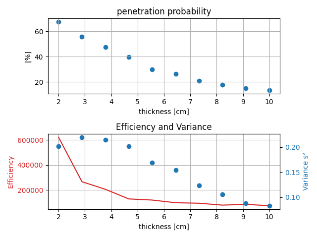

# MATH-410 Monte-Carlo Project
This is the repository of some university project regarding Monte-Carlo algorithm for:
- neutron transport
- genetic algorithm

## Neutron transport

### Benchmarking

### Simulation
The logic should be written to ensure that:
- Large amount of neutron are processed at the same time to facilitate vectorization and avoid the use of python
to process large amount of data (numpy will do it faster)
- The variance should be easily extracted

#### Variance computation
$D^2(I) = D^2\left(\frac{1}{N} \sum_k h(n_k)\right)$ where $n_k$ are the incident neutrons,
$s^2 = \frac{1}{N} \sum_k (h(n_k))^2 - I^2$. Note that we need to know the result for each incident neutron at the end:
We keep track of their respective descendants to differentiate their contributions.

### Results
For 1000 initial neutrons and parameter the associated commit
